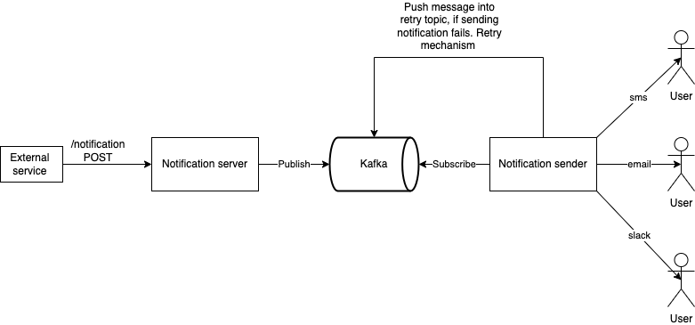

# Notification-system

## The Big picture

Our notifiction system is just a small part of a bigger application. This application can be a Jenkins job, which notificates users when pipeline is completed, or an application similar to Facebook, which notificates users when someone has sent a friend request or has commented on your photo. The goal of our application is to be highly scalable and fault tolerant. 


As you can see from the picture, our application will have only one endpoint. Parameteres, that our endpoint can take, are the message, the type of notification(EMAIL, SLACK or SMS) and the receiver. As you can see from the picture, there is a database in the service which integrates our system. This db will keep the information about the users and their devices. For example user A can have an email and phone number, and we can notificate him, on any of this channel. 

## Architecture




The notification system contains three main parts. 

A producer microservice(notification service), one of the purposes of this microservice is to expose internal endpoint to the main application. This endpoint is responsible for validating the notification and adding it into the kakfa queue. For now we are supporting three different notification channels(EMAIL, SLACK, SMS) and we have kafka topic for each of these types. 

The second part of our system is the kafka. Currently we setup the kafka as simple as possible(have only one partition for our topics), but we can easily extend it. 

The third part of our system is the notification sender. This service has two main functionalities, subscribing for topics and sending the notification using the correct communication channel. It has third hidden functionality for the end user, retry mechanism. If sending a notification fails, for example the third party library, which we use to send the notification to is not working now, we retry 5 times. If after the fifth retry, still something is failing, the notification will be added to the dead letter queue, which can be used for analyzing and monitoring. 

Example request for sending notification:
```
curl --location --request POST 'http://localhost:8020/notification' \
--header 'Accept: application/json' \
--header 'Content-Type: application/json' \
--data-raw '{"type": "EMAIL", "message": "Hello World", "receiver": "test@gmail.com"}
```

## Initial steps
### 1. Run kafka on your local machine:
First you need to have docker installed on your machine. Here is a
documentation how to install docker on your machine: .
#### 1.1. Pull kafka image from docker registry:
```
docker pull spotify/kafka
```
#### 1.2. Run kafka from the docker image as container:
```
docker run -p 2181:2181 -p 9092:9092 --name kafka-docker-container --env ADVERTISED_HOST=127.0.0.1 --env ADVERTISED_PORT=9092 spotify/kafka
```

#### 1.3. Exec to container
The first step is to get the container id
```
docker ps| grep kafka-docker-container
```
Next step is to run docker exec
```
docker exec -it <container-id> /bin/bash
```
#### 1.3. Create kafka topics:
Kafka topic for sms notifications:

```
/opt/kafka_2.11-0.10.1.0/bin/kafka-topics.sh --create --topic sms-notification-topic --partitions 1 --replication-factor 1 --zookeeper localhost:2181
```

Kafka topic for slack notifications:
```
/opt/kafka_2.11-0.10.1.0/bin/kafka-topics.sh --create --topic slack-notification-topic --partitions 1 --replication-factor 1 --zookeeper localhost:2181
```

Kafka topic for email notifications:
```
/opt/kafka_2.11-0.10.1.0/bin/kafka-topics.sh --create --topic email-notification-topic --partitions 1 --replication-factor 1 --zookeeper localhost:2181
```

### 2. Run the first microservice
```
cd services/notification-server
go run .
```

### 3. Run the second microservice
```
cd ../notification-sender
go run .
```

## Feature enhancements

### Kubernetes

To ensure that our application is scalable is mandatory to add k8s. With kubernetes we can 
wrap our microservices into deployments, using deployments we can easily scale up and down,
and apply different deployemnt strategies. Also we can improve the security using cloud accounts
and cluster roles. Also another good practice, that we can use is k8s secrets to store
our sensative inforamtion, such as passwords, accounts etc. 

### Kafka

Currently our kafka cluster is having several number of topics, and each topic has 
only one partion , and every partion has also only one replica. To increase the 
throughput, there are few good practices that we can use:

1. Create consumer groups. Each consumer group will subscribe for specific topic,
and every consumer will be responsible for specific partion of the topic. 

2. Multiple producers. Every producer to be responsible only for one topic, or 
even be responsible only for one partion of this topic.

Code can be easily extended to handle these enhancements. 

### Rate limiting

Reat limiting can be added to avoid overwhelming user with too many notifications. 
This is important, because user can unsubscribe, if we send too often. I can think
of facebook birthday notifications, that I'm receiving every day, it's so anoying 
that I gmail created separate folder to store them.

### CI/CD

If you want to make the process of delivering new features more smooth and have feedback for
your change as soon as possible, using CI/CD is the answer. I will not go into detail here,
because the topic is huge, the benefits that we will have if we setup CI/CD are numerous, but we should
consider that they come with some disadvantages such as complexity and time for maintaining the 
pipelines.


### Tests

We should think about different testing scenarios. If we want our application to have
small rate of bugs, we should create more unit tests, IT, end to end test and make
some performance tests.

### Monitoring 

Here we can use different tools to monitor our application such as Grafana, Prometheus etc.
We also should monitor and analyze the dead letter queue, and find what are the problems.


