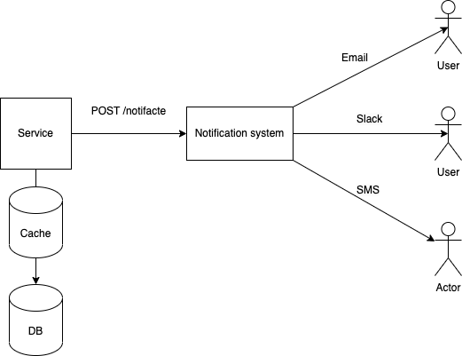

# Notification-system

## The Big picture

Our notifiction system is just a small part of a bigger application. This application can be a Jenkins job, which notificates users when pipeline is completed, or an application similar to Facebook, which notificates users when someone has sent a friend request or has commented on your photo. The goal of our application is to be highly scalable and fault tolerant. 



As you can see from the picture, our application will have only one endpoint. Parameteres, that our endpoint can take, are the message, the type of notification(EMAIL, SLACK or SMS) and the receiver. As you can see from the picture, there is a database in the service which integrates our system. This db will keep the information about the users and their devices. For example user A can have an email and phone number, and we can notificate him, on any of this channel. 

## Architecture

## Initial steps
### 1. Run kafka on your local machine:
First you need to have docker installed on your machine. Here is a
documentation how to install docker on your machine: .
#### 1.1. Pull kafka image from docker registry:
```
docker pull spotify/kafka
```
#### 1.2. Run kafka from the docker image as container:
```
docker run -p 2181:2181 -p 9092:9092 --name kafka-docker-container --env ADVERTISED_HOST=127.0.0.1 --env ADVERTISED_PORT=9092 spotify/kafka
```

#### 1.3. Exec to container
The first step is to get the container id
```
docker ps| grep kafka-docker-container
```
Next step is to run docker exec
```
docker exec -it <container-id> /bin/bash
```
#### 1.3. Create kafka topics:
Kafka topic for sms notifications:

```
/opt/kafka_2.11-0.10.1.0/bin/kafka-topics.sh --create --topic sms-notification-topic --partitions 1 --replication-factor 1 --zookeeper localhost:2181
```

Kafka topic for slack notifications:
```
/opt/kafka_2.11-0.10.1.0/bin/kafka-topics.sh --create --topic slack-notification-topic --partitions 1 --replication-factor 1 --zookeeper localhost:2181
```

Kafka topic for email notifications:
```
/opt/kafka_2.11-0.10.1.0/bin/kafka-topics.sh --create --topic email-notification-topic --partitions 1 --replication-factor 1 --zookeeper localhost:2181
```

### 2. Run the first microservice
```
cd services/notification-server
go run .
```

### 3. Run the second microservice
```
cd ../notification-sender
go run .
```

